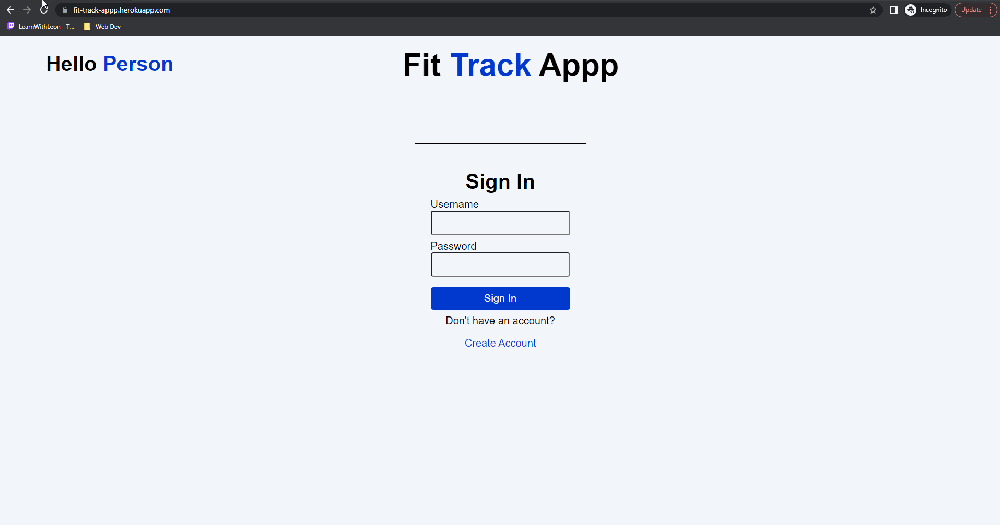

# Fit Track Appp
A full stack web application that allows users to create and account and save a log of their body weight to track their progress over time.

**Link to project:** https://fit-track-appp.herokuapp.com/

## How It's Made:

**Tech used:** React, MongoDB, Express, Node.js

## Optimizations
I plan on making the following addition:
1. Implementing Chart.js so users can see a graph of their logs over time.

2. Extending the app to allow users to track their workouts as well and see the progress on their exercises over time.

## Challenges Faced/Lessons Learned:

